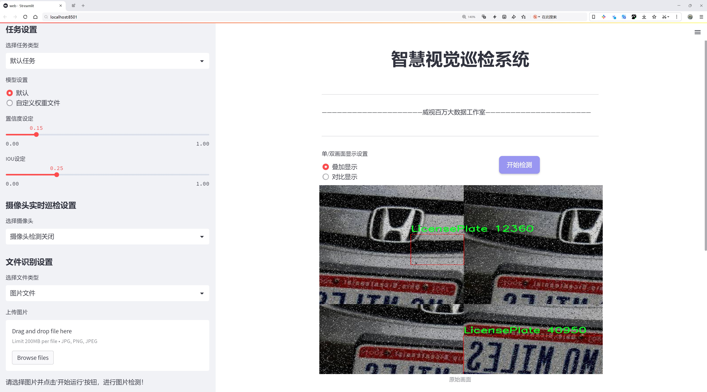
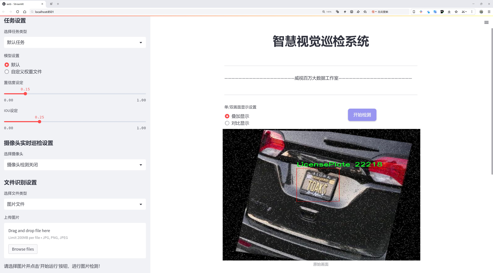
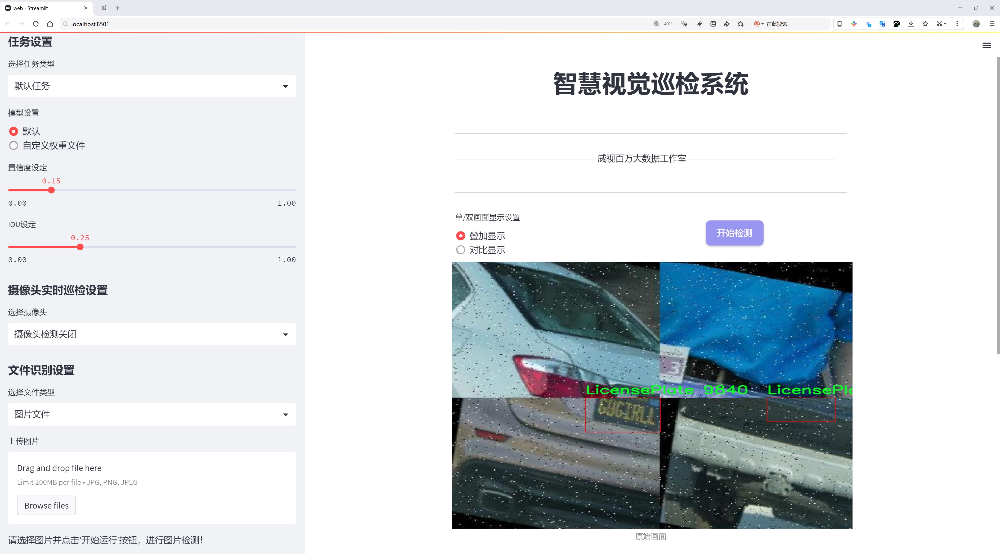
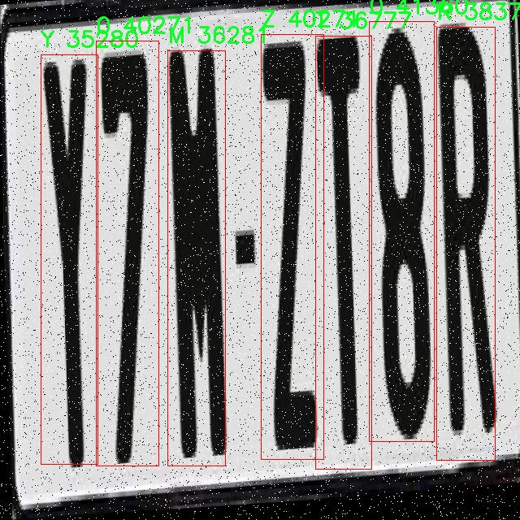
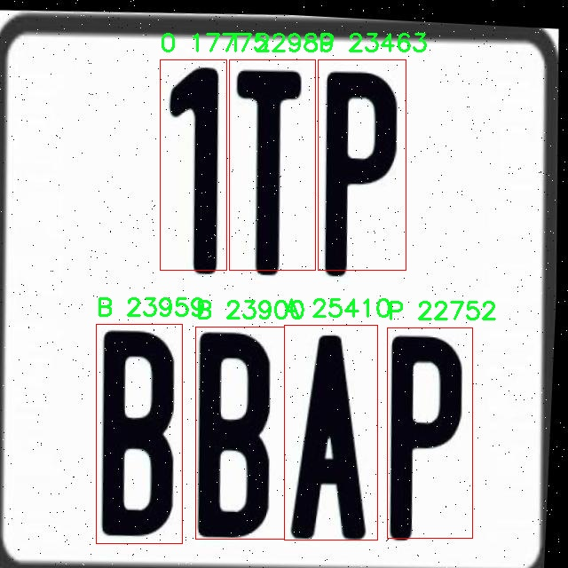
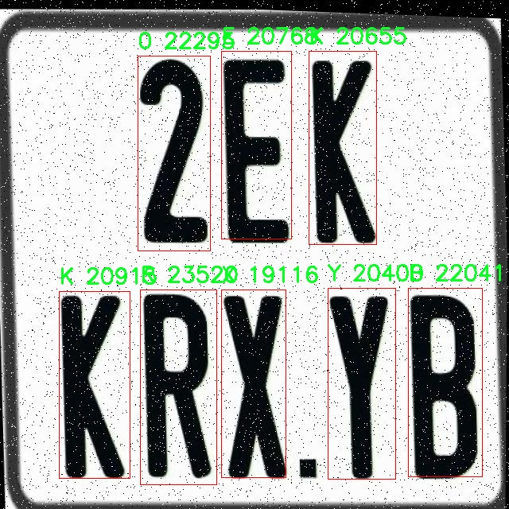
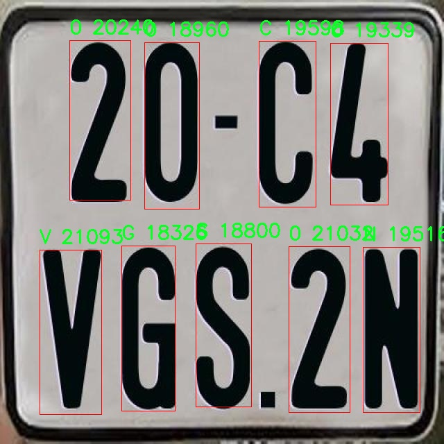

# 车牌识别检测系统源码分享
 # [一条龙教学YOLOV8标注好的数据集一键训练_70+全套改进创新点发刊_Web前端展示]

### 1.研究背景与意义

项目参考[AAAI Association for the Advancement of Artificial Intelligence](https://gitee.com/qunmasj/projects)

项目来源[AACV Association for the Advancement of Computer Vision](https://github.com/qunshansj/good)

研究背景与意义

随着社会经济的快速发展和城市化进程的加快，机动车辆的数量不断增加，交通管理和安全问题日益突出。车牌识别技术（Automatic Number Plate Recognition, ANPR）作为智能交通系统的重要组成部分，能够有效地实现对车辆的自动识别和管理，广泛应用于交通监控、停车管理、道路收费等领域。传统的车牌识别方法多依赖于人工特征提取和分类，存在准确率低、处理速度慢等缺陷。近年来，深度学习技术的迅猛发展为车牌识别提供了新的解决方案，尤其是基于卷积神经网络（CNN）的目标检测模型，如YOLO（You Only Look Once）系列，因其高效性和准确性而受到广泛关注。

YOLOv8作为YOLO系列的最新版本，进一步提升了目标检测的性能，其在处理速度和准确率方面均表现出色。然而，尽管YOLOv8在多种目标检测任务中取得了显著的成果，但在特定应用场景下，如车牌识别，仍然存在一定的挑战。车牌的多样性、复杂的背景以及不同的拍摄角度都可能影响识别的准确性。因此，针对车牌识别任务对YOLOv8进行改进，提升其在该领域的表现，具有重要的研究意义。

本研究将基于改进的YOLOv8模型，构建一个高效的车牌识别系统。为此，我们将利用一个包含3941张图像和23个类别的车牌数据集进行训练和测试。该数据集不仅涵盖了多种车牌类型（如字母和数字），还包含了丰富的场景变化和光照条件，为模型的训练提供了良好的基础。通过对数据集的深入分析，我们可以识别出车牌识别中常见的挑战，如字符遮挡、模糊、反光等，从而在模型设计中采取相应的改进措施。

在研究过程中，我们将重点关注模型的精度和实时性，探索如何通过数据增强、模型剪枝、特征融合等技术手段，提升YOLOv8在车牌识别任务中的表现。此外，我们还将通过对比实验，评估改进后的模型在不同场景下的适应性和鲁棒性，确保其能够在实际应用中发挥有效作用。

本研究的意义不仅在于推动车牌识别技术的发展，还在于为智能交通系统的建设提供技术支持。随着智能城市的建设日益深入，车牌识别技术的应用前景广阔，能够有效提升交通管理的智能化水平，降低人工成本，提高工作效率。同时，研究成果也将为相关领域的学术研究提供参考，推动深度学习技术在更多实际应用中的落地。

综上所述，基于改进YOLOv8的车牌识别系统的研究，不仅具有重要的理论价值，也具有广泛的实际应用前景。通过本研究，我们期望能够为智能交通系统的建设贡献一份力量，推动社会的可持续发展。

### 2.图片演示







##### 注意：由于此博客编辑较早，上面“2.图片演示”和“3.视频演示”展示的系统图片或者视频可能为老版本，新版本在老版本的基础上升级如下：（实际效果以升级的新版本为准）

  （1）适配了YOLOV8的“目标检测”模型和“实例分割”模型，通过加载相应的权重（.pt）文件即可自适应加载模型。

  （2）支持“图片识别”、“视频识别”、“摄像头实时识别”三种识别模式。

  （3）支持“图片识别”、“视频识别”、“摄像头实时识别”三种识别结果保存导出，解决手动导出（容易卡顿出现爆内存）存在的问题，识别完自动保存结果并导出到tempDir中。

  （4）支持Web前端系统中的标题、背景图等自定义修改，后面提供修改教程。

  另外本项目提供训练的数据集和训练教程,暂不提供权重文件（best.pt）,需要您按照教程进行训练后实现图片演示和Web前端界面演示的效果。

### 3.视频演示

[3.1 视频演示](https://www.bilibili.com/video/BV1j2nfeuEen/?vd_source=ff015de2d29cbe2a9cdbfa7064407a08)

### 4.数据集信息展示

数据集信息展示

在现代智能交通系统中，车牌识别技术的应用日益广泛，其核心在于高效准确的图像识别能力。为此，我们采用了名为“ANPR”的数据集，以训练和改进YOLOv8的车牌识别系统。该数据集专门设计用于车牌识别任务，涵盖了多种字符类别，能够有效支持模型的学习和推理过程。

“ANPR”数据集包含23个类别，具体类别列表为：‘0’, ‘A’, ‘B’, ‘C’, ‘D’, ‘E’, ‘F’, ‘G’, ‘H’, ‘K’, ‘L’, ‘LicensePlate’, ‘M’, ‘N’, ‘P’, ‘R’, ‘S’, ‘T’, ‘U’, ‘V’, ‘X’, ‘Y’, ‘Z’。这些类别不仅包括数字和字母，还特别设置了一个“LicensePlate”类别，旨在帮助模型识别整个车牌的区域。这种类别划分的设计，使得模型在训练过程中能够更好地理解车牌的结构和组成，进而提升识别的准确性。

数据集中的字符类别涵盖了从数字‘0’到字母‘Z’的所有可能组合，确保了对各种车牌格式的全面覆盖。这一特性对于多样化的车牌样式尤其重要，因为不同地区和国家的车牌设计可能存在显著差异。通过引入丰富的字符类别，模型可以学习到更复杂的字符组合，从而在实际应用中更好地适应不同的车牌识别场景。

在数据集的构建过程中，考虑到了多种因素以确保其有效性和实用性。首先，数据集中的图像样本来源于不同的环境和光照条件，确保模型在各种实际场景下的鲁棒性。其次，样本的多样性也体现在车牌的颜色、字体和尺寸等方面，这些都是影响识别性能的重要因素。通过这样的设计，数据集能够为YOLOv8模型提供丰富的训练数据，使其在识别过程中能够有效应对各种挑战。

此外，数据集的标注工作也经过严格的审核和校正，确保每个图像中的字符和车牌区域都被准确标记。这种高质量的标注不仅提升了训练的有效性，也为后续的模型评估提供了可靠的基准。模型在训练过程中，通过不断迭代学习和优化，能够逐步提高对车牌的识别精度和速度。

在使用“ANPR”数据集进行YOLOv8模型训练时，研究者们可以通过多种数据增强技术进一步提升模型的泛化能力。例如，随机裁剪、旋转、亮度调整等手段可以有效增加训练样本的多样性，从而使模型在面对未见过的车牌样式时，依然能够保持较高的识别率。

综上所述，“ANPR”数据集为车牌识别系统的研究与开发提供了坚实的基础。通过精心设计的类别划分和丰富的样本特征，该数据集不仅提升了YOLOv8模型的训练效果，也为未来的车牌识别技术进步奠定了重要的理论和实践基础。随着技术的不断发展，基于“ANPR”数据集的研究将有助于推动智能交通系统的进一步优化和普及。










### 5.全套项目环境部署视频教程（零基础手把手教学）

[5.1 环境部署教程链接（零基础手把手教学）](https://www.ixigua.com/7404473917358506534?logTag=c807d0cbc21c0ef59de5)


[5.2 安装Python虚拟环境创建和依赖库安装视频教程链接（零基础手把手教学）](https://www.ixigua.com/7404474678003106304?logTag=1f1041108cd1f708b01a)

### 6.手把手YOLOV8训练视频教程（零基础小白有手就能学会）

[6.1 环境部署教程链接（零基础手把手教学）](https://www.ixigua.com/7404477157818401292?logTag=d31a2dfd1983c9668658)

### 7.70+种全套YOLOV8创新点代码加载调参视频教程（一键加载写好的改进模型的配置文件）

[7.1 环境部署教程链接（零基础手把手教学）](https://www.ixigua.com/7404478314661806627?logTag=29066f8288e3f4eea3a4)

### 8.70+种全套YOLOV8创新点原理讲解（非科班也可以轻松写刊发刊，V10版本正在科研待更新）

由于篇幅限制，每个创新点的具体原理讲解就不一一展开，具体见下列网址中的创新点对应子项目的技术原理博客网址【Blog】：


[8.1 70+种全套YOLOV8创新点原理讲解链接](https://gitee.com/qunmasj/good)

### 9.系统功能展示（检测对象为举例，实际内容以本项目数据集为准）

图9.1.系统支持检测结果表格显示

  图9.2.系统支持置信度和IOU阈值手动调节

  图9.3.系统支持自定义加载权重文件best.pt(需要你通过步骤5中训练获得)

  图9.4.系统支持摄像头实时识别

  图9.5.系统支持图片识别

  图9.6.系统支持视频识别

  图9.7.系统支持识别结果文件自动保存

  图9.8.系统支持Excel导出检测结果数据


### 10.原始YOLOV8算法原理

原始YOLOv8算法原理

YOLOv8算法是由Ultralytics在2023年1月发布的一款先进目标检测模型，它在YOLO系列的基础上进行了多项创新和改进，特别是在数据预处理、网络结构、标签分配策略和损失函数等方面。YOLOv8不仅继承了YOLOv3、YOLOv5等前代模型的优点，还融合了YOLOX、YOLOv6、YOLOv7和PPYOLOE等算法的设计理念，形成了一种集百家所长的全新架构，极大地提升了目标检测的精度和速度。

首先，在数据预处理方面，YOLOv8延续了YOLOv5的策略，采用了多种数据增强技术来提升模型的鲁棒性和泛化能力。这些增强手段包括马赛克增强、混合增强、空间扰动和颜色扰动等。马赛克增强通过将多张图像拼接在一起，生成新的训练样本，从而提高模型对不同场景的适应能力；混合增强则通过将两张图像进行加权组合，增强了图像的多样性；空间扰动和颜色扰动则通过随机变换图像的空间位置和颜色特征，进一步丰富了训练数据。这些数据预处理技术的结合，使得YOLOv8在面对复杂环境时，能够更好地识别和定位目标。

在网络结构方面，YOLOv8的骨干网络结构从YOLOv5中汲取了灵感，采用了CSPDarknet作为特征提取的基础。与YOLOv5的C3模块相比，YOLOv8引入了新的C2f模块，增加了更多的分支，以丰富梯度回传时的支流。这种设计使得模型在特征提取过程中能够更有效地捕捉多层次的信息，从而提高了特征的表达能力。此外，YOLOv8仍然采用了特征金字塔网络（FPN）和路径聚合网络（PAN）的结构，以充分融合多尺度信息，增强了模型对不同尺寸目标的检测能力。

YOLOv8在检测头的设计上也进行了创新，采用了解耦头（Decoupled Head）结构。这一结构将分类和定位任务分为两个并行的分支，分别提取类别特征和位置特征。通过这种方式，YOLOv8能够更精准地完成目标的分类和定位，提高了检测的准确性。相较于之前的耦合头设计，解耦头在处理复杂场景时，能够更好地应对目标之间的相互干扰，提升了模型的整体性能。

标签分配策略是YOLOv8的一大亮点。尽管YOLOv5引入了自动聚类候选框的功能，但这种方法依赖于数据集的充分性，可能导致聚类结果与真实物体尺寸不匹配。YOLOv8则采用了动态标签分配策略，借鉴了YOLOv6的TOOD策略，避免了候选框的限制。该策略通过仅使用目标框和目标分数，简化了标签分配的过程。YOLOv8的损失函数主要由类别损失和位置损失两部分组成，其中类别损失采用了变焦损失（Varifocal Loss），而回归损失则结合了CIoU Loss和DFL Loss。这种设计使得YOLOv8在处理正负样本时，能够更有效地加权损失，尤其是在高质量样本的训练中，提升了模型的AP（Average Precision）表现。

在具体实现上，YOLOv8s模型作为YOLOv8系列的一部分，采用了更为高效的特征提取和目标检测方式。其特征提取部分通过CSPDarknet结构进行，使用C2f模块替换了C3模块，增强了特征图的维度和梯度流信息。此外，YOLOv8s还引入了快速空间金字塔池化（SPPF）结构，以提取不同尺度的特征，显著提高了特征提取的效率。

YOLOv8的目标检测部分则结合了FPN和PAN结构，通过多个卷积层和池化层处理特征图，最终输出目标检测结果。值得注意的是，YOLOv8s采用了无锚框（Anchor-Free）的检测方式，直接预测目标的中心点和宽高比例，这一创新减少了对Anchor框的依赖，提高了检测速度和准确度。

综上所述，YOLOv8算法通过多方面的改进和创新，达到了实时检测领域的新高度。其高精度和快速响应的特性，使得YOLOv8在目标检测领域具有广泛的应用潜力，尤其是在自动化农业、智能监控等场景中，能够有效提升目标识别和定位的效率。随着YOLOv8的推广和应用，目标检测技术将迎来新的发展机遇，推动相关领域的进步与创新。


### 11.项目核心源码讲解（再也不用担心看不懂代码逻辑）

#### 11.1 ui.py

以下是经过简化和注释的核心代码部分：

```python
import sys
import subprocess
from QtFusion.path import abs_path

def run_script(script_path):
    """
    使用当前 Python 环境运行指定的脚本。

    Args:
        script_path (str): 要运行的脚本路径
    """
    # 获取当前 Python 解释器的路径
    python_path = sys.executable

    # 构建运行命令，使用 streamlit 运行指定的脚本
    command = f'"{python_path}" -m streamlit run "{script_path}"'

    # 执行命令并等待其完成
    result = subprocess.run(command, shell=True)
    
    # 检查命令执行结果，如果返回码不为0，表示出错
    if result.returncode != 0:
        print("脚本运行出错。")

# 主程序入口
if __name__ == "__main__":
    # 获取要运行的脚本的绝对路径
    script_path = abs_path("web.py")

    # 调用函数运行脚本
    run_script(script_path)
```

### 代码分析和注释：

1. **导入模块**：
   - `sys`：用于访问与 Python 解释器相关的变量和函数。
   - `subprocess`：用于执行外部命令。
   - `abs_path`：从 `QtFusion.path` 导入的函数，用于获取文件的绝对路径。

2. **`run_script` 函数**：
   - 功能：使用当前 Python 环境运行指定的脚本。
   - 参数：`script_path` 是要运行的脚本的路径。
   - 实现：
     - 获取当前 Python 解释器的路径，存储在 `python_path` 变量中。
     - 构建命令字符串，使用 `streamlit` 模块运行指定的脚本。
     - 使用 `subprocess.run` 执行命令，并等待其完成。
     - 检查命令的返回码，如果不为0，打印错误信息。

3. **主程序入口**：
   - 通过 `if __name__ == "__main__":` 确保代码只在直接运行时执行。
   - 使用 `abs_path` 获取要运行的脚本 `web.py` 的绝对路径。
   - 调用 `run_script` 函数，传入脚本路径以执行该脚本。

这个程序文件 `ui.py` 的主要功能是运行一个指定的 Python 脚本，具体来说是使用 Streamlit 框架来启动一个 Web 应用。代码的结构和功能可以分为几个部分。

首先，文件导入了一些必要的模块，包括 `sys`、`os` 和 `subprocess`。`sys` 模块用于访问与 Python 解释器交互的变量和函数，`os` 模块提供了与操作系统交互的功能，而 `subprocess` 模块则用于创建新进程、连接到它们的输入/输出/错误管道，并获取它们的返回码。

接下来，代码定义了一个名为 `run_script` 的函数。这个函数接收一个参数 `script_path`，它是要运行的脚本的路径。在函数内部，首先获取当前 Python 解释器的路径，这通过 `sys.executable` 实现。然后，构建一个命令字符串，使用 `streamlit run` 命令来运行指定的脚本。这个命令会在一个新的进程中执行，`subprocess.run` 函数用于实际执行这个命令。

在执行命令后，代码检查返回的结果。如果返回码不为零，表示脚本运行出错，程序会打印出错误信息。

最后，代码通过 `if __name__ == "__main__":` 这一条件判断，确保只有在直接运行该文件时才会执行后面的代码。在这个条件下，指定了要运行的脚本路径，这里是 `web.py`，并调用 `run_script` 函数来执行这个脚本。

总的来说，这个文件的功能是提供一个简单的接口，通过命令行启动一个 Streamlit Web 应用，方便用户在当前的 Python 环境中运行指定的脚本。

#### 11.2 ultralytics\solutions\heatmap.py

以下是代码中最核心的部分，并附上详细的中文注释：

```python
import cv2
import numpy as np
from collections import defaultdict
from shapely.geometry import LineString, Point, Polygon

class Heatmap:
    """用于实时视频流中绘制热图的类，基于对象的轨迹。"""

    def __init__(self):
        """初始化热图类，设置默认的可视化、图像和跟踪参数。"""
        # 可视化信息
        self.annotator = None  # 注释器，用于绘制文本和形状
        self.view_img = False  # 是否显示图像
        self.shape = "circle"  # 热图形状，默认为圆形

        # 图像信息
        self.imw = None  # 图像宽度
        self.imh = None  # 图像高度
        self.im0 = None  # 原始图像
        self.view_in_counts = True  # 是否显示进入计数
        self.view_out_counts = True  # 是否显示离开计数

        # 热图颜色映射和热图数组
        self.colormap = None  # 热图颜色映射
        self.heatmap = None  # 热图数据
        self.heatmap_alpha = 0.5  # 热图透明度

        # 预测/跟踪信息
        self.boxes = None  # 检测框
        self.track_ids = None  # 跟踪ID
        self.clss = None  # 类别
        self.track_history = defaultdict(list)  # 跟踪历史记录

        # 区域和线信息
        self.count_reg_pts = None  # 计数区域的点
        self.counting_region = None  # 计数区域
        self.line_dist_thresh = 15  # 线计数的距离阈值
        self.region_thickness = 5  # 区域厚度
        self.region_color = (255, 0, 255)  # 区域颜色

        # 对象计数信息
        self.in_counts = 0  # 进入计数
        self.out_counts = 0  # 离开计数
        self.counting_list = []  # 正在计数的对象列表
        self.count_txt_thickness = 0  # 计数文本厚度
        self.count_txt_color = (0, 0, 0)  # 计数文本颜色
        self.count_color = (255, 255, 255)  # 计数背景颜色

        # 衰减因子
        self.decay_factor = 0.99  # 热图衰减因子

    def set_args(self, imw, imh, colormap=cv2.COLORMAP_JET, heatmap_alpha=0.5, view_img=False,
                 view_in_counts=True, view_out_counts=True, count_reg_pts=None,
                 count_txt_thickness=2, count_txt_color=(0, 0, 0), count_color=(255, 255, 255),
                 count_reg_color=(255, 0, 255), region_thickness=5, line_dist_thresh=15,
                 decay_factor=0.99, shape="circle"):
        """
        配置热图的颜色映射、宽度、高度和显示参数。
        """
        self.imw = imw  # 设置图像宽度
        self.imh = imh  # 设置图像高度
        self.heatmap_alpha = heatmap_alpha  # 设置热图透明度
        self.view_img = view_img  # 设置是否显示图像
        self.view_in_counts = view_in_counts  # 设置是否显示进入计数
        self.view_out_counts = view_out_counts  # 设置是否显示离开计数
        self.colormap = colormap  # 设置热图颜色映射

        # 设置计数区域
        if count_reg_pts is not None:
            if len(count_reg_pts) == 2:  # 线计数
                self.count_reg_pts = count_reg_pts
                self.counting_region = LineString(count_reg_pts)
            elif len(count_reg_pts) == 4:  # 区域计数
                self.count_reg_pts = count_reg_pts
                self.counting_region = Polygon(self.count_reg_pts)
            else:
                print("无效的区域或线点，支持2或4个点")
                self.counting_region = Polygon([(20, 400), (1260, 400)])  # 默认线

        # 初始化热图
        self.heatmap = np.zeros((int(self.imh), int(self.imw)), dtype=np.float32)

        # 设置其他参数
        self.count_txt_thickness = count_txt_thickness
        self.count_txt_color = count_txt_color
        self.count_color = count_color
        self.region_color = count_reg_color
        self.region_thickness = region_thickness
        self.decay_factor = decay_factor
        self.line_dist_thresh = line_dist_thresh
        self.shape = shape  # 设置热图形状

    def extract_results(self, tracks):
        """
        从提供的数据中提取结果。
        """
        self.boxes = tracks[0].boxes.xyxy.cpu()  # 提取检测框
        self.clss = tracks[0].boxes.cls.cpu().tolist()  # 提取类别
        self.track_ids = tracks[0].boxes.id.int().cpu().tolist()  # 提取跟踪ID

    def generate_heatmap(self, im0, tracks):
        """
        根据跟踪数据生成热图。
        """
        self.im0 = im0  # 设置当前图像
        if tracks[0].boxes.id is None:  # 如果没有检测到物体
            return
        self.heatmap *= self.decay_factor  # 应用衰减因子
        self.extract_results(tracks)  # 提取跟踪结果

        # 绘制计数区域
        if self.count_reg_pts is not None:
            for box, track_id in zip(self.boxes, self.track_ids):
                # 根据形状绘制热图
                if self.shape == "circle":
                    center = (int((box[0] + box[2]) // 2), int((box[1] + box[3]) // 2))
                    radius = min(int(box[2]) - int(box[0]), int(box[3]) - int(box[1])) // 2
                    y, x = np.ogrid[0:self.heatmap.shape[0], 0:self.heatmap.shape[1]]
                    mask = (x - center[0]) ** 2 + (y - center[1]) ** 2 <= radius**2
                    self.heatmap[int(box[1]):int(box[3]), int(box[0]):int(box[2])] += (
                        2 * mask[int(box[1]):int(box[3]), int(box[0]):int(box[2])]
                    )
                else:
                    self.heatmap[int(box[1]):int(box[3]), int(box[0]):int(box[2])] += 2

                # 统计对象
                track_line = self.track_history[track_id]
                track_line.append((float((box[0] + box[2]) / 2), float((box[1] + box[3]) / 2)))
                if len(track_line) > 30:
                    track_line.pop(0)

                # 计数逻辑
                if len(self.count_reg_pts) == 4:
                    if self.counting_region.contains(Point(track_line[-1])) and track_id not in self.counting_list:
                        self.counting_list.append(track_id)
                        if box[0] < self.counting_region.centroid.x:
                            self.out_counts += 1
                        else:
                            self.in_counts += 1

                elif len(self.count_reg_pts) == 2:
                    distance = Point(track_line[-1]).distance(self.counting_region)
                    if distance < self.line_dist_thresh and track_id not in self.counting_list:
                        self.counting_list.append(track_id)
                        if box[0] < self.counting_region.centroid.x:
                            self.out_counts += 1
                        else:
                            self.in_counts += 1

        # 归一化热图并与原始图像合成
        heatmap_normalized = cv2.normalize(self.heatmap, None, 0, 255, cv2.NORM_MINMAX)
        heatmap_colored = cv2.applyColorMap(heatmap_normalized.astype(np.uint8), self.colormap)
        self.im0 = cv2.addWeighted(self.im0, 1 - self.heatmap_alpha, heatmap_colored, self.heatmap_alpha, 0)

        return self.im0  # 返回合成后的图像

    def display_frames(self):
        """显示当前帧。"""
        cv2.imshow("Ultralytics Heatmap", self.im0)
        if cv2.waitKey(1) & 0xFF == ord("q"):
            return

if __name__ == "__main__":
    Heatmap()  # 创建热图对象
```

### 代码核心部分说明：
1. **Heatmap类**：用于实时视频流中绘制热图，基于对象的轨迹。
2. **初始化方法**：设置各种参数，包括可视化、图像信息、热图参数、计数信息等。
3. **set_args方法**：配置热图的颜色映射、宽度、高度和显示参数。
4. **extract_results方法**：从跟踪数据中提取检测框、类别和跟踪ID。
5. **generate_heatmap方法**：根据跟踪数据生成热图，并处理对象计数逻辑。
6. **display_frames方法**：显示当前帧图像。

以上代码通过热图的方式展示对象的轨迹和计数，适用于实时监控和分析场景。

这个程序文件定义了一个名为 `Heatmap` 的类，用于在实时视频流中基于物体轨迹绘制热图。程序首先导入了一些必要的库，包括 `cv2`（OpenCV库）和 `numpy`，以及一些用于几何计算的库，如 `shapely`。它还检查了环境是否支持图像显示。

在 `Heatmap` 类的构造函数中，初始化了一些属性，包括视觉信息、图像信息、热图参数、预测/跟踪信息、区域和线的信息、物体计数信息等。具体来说，热图的形状、颜色、透明度等参数都在这里设置。

`set_args` 方法用于配置热图的参数，包括图像的宽度和高度、热图的颜色映射、透明度、是否显示图像、计数区域的点、文本厚度和颜色等。该方法还支持定义计数区域，可以是线或多边形。

`extract_results` 方法从跟踪数据中提取结果，包括边界框、类别和跟踪ID。`generate_heatmap` 方法则根据跟踪数据生成热图。它首先对热图进行衰减处理，然后提取跟踪结果，并使用 `Annotator` 类来绘制计数区域和热图。

在生成热图的过程中，程序会根据物体的边界框计算热图的值，并根据设定的形状（圆形或矩形）来更新热图。同时，程序会根据物体的位置和计数区域来统计物体的进出数量。

最后，程序会对热图进行归一化处理，并将其与原始图像进行合成。根据用户的设置，程序会显示物体的进出计数，并在窗口中展示最终的图像。

如果程序在支持图像显示的环境中运行，`display_frames` 方法会显示当前帧，并允许用户通过按下 "q" 键退出显示。

整体而言，这个程序提供了一个实时热图生成的功能，能够有效地跟踪和计数视频流中的物体。

#### 11.3 ultralytics\utils\dist.py

以下是经过简化和注释的核心代码部分：

```python
import os
import shutil
import socket
import sys
import tempfile

from . import USER_CONFIG_DIR
from .torch_utils import TORCH_1_9

def find_free_network_port() -> int:
    """
    查找本地主机上可用的网络端口。

    这个函数在单节点训练时非常有用，因为我们不想连接到真实的主节点，但需要设置
    `MASTER_PORT` 环境变量。
    """
    with socket.socket(socket.AF_INET, socket.SOCK_STREAM) as s:
        s.bind(("127.0.0.1", 0))  # 绑定到本地地址和随机端口
        return s.getsockname()[1]  # 返回绑定的端口号


def generate_ddp_file(trainer):
    """
    生成一个 DDP 文件并返回其文件名。

    DDP（Distributed Data Parallel）用于分布式训练，生成的文件包含训练的配置和逻辑。
    """
    # 获取训练器的模块和类名
    module, name = f"{trainer.__class__.__module__}.{trainer.__class__.__name__}".rsplit(".", 1)

    # 创建文件内容
    content = f"""
# Ultralytics 多GPU训练临时文件（使用后应自动删除）
overrides = {vars(trainer.args)}  # 获取训练参数

if __name__ == "__main__":
    from {module} import {name}  # 导入训练器类
    from ultralytics.utils import DEFAULT_CFG_DICT  # 导入默认配置字典

    cfg = DEFAULT_CFG_DICT.copy()  # 复制默认配置
    cfg.update(save_dir='')  # 处理额外的 'save_dir' 键
    trainer = {name}(cfg=cfg, overrides=overrides)  # 实例化训练器
    results = trainer.train()  # 开始训练
"""
    # 创建 DDP 目录（如果不存在）
    (USER_CONFIG_DIR / "DDP").mkdir(exist_ok=True)
    
    # 创建临时文件并写入内容
    with tempfile.NamedTemporaryFile(
        prefix="_temp_",
        suffix=f"{id(trainer)}.py",  # 使用训练器的ID作为后缀
        mode="w+",
        encoding="utf-8",
        dir=USER_CONFIG_DIR / "DDP",  # 指定目录
        delete=False,  # 不自动删除
    ) as file:
        file.write(content)  # 写入内容
    return file.name  # 返回文件名


def generate_ddp_command(world_size, trainer):
    """
    生成并返回用于分布式训练的命令。

    :param world_size: 训练的进程数
    :param trainer: 训练器实例
    :return: 生成的命令和临时文件名
    """
    import __main__  # 本地导入以避免潜在问题

    if not trainer.resume:
        shutil.rmtree(trainer.save_dir)  # 如果不恢复训练，删除保存目录
    
    file = generate_ddp_file(trainer)  # 生成 DDP 文件
    dist_cmd = "torch.distributed.run" if TORCH_1_9 else "torch.distributed.launch"  # 根据 PyTorch 版本选择命令
    port = find_free_network_port()  # 查找可用端口
    cmd = [sys.executable, "-m", dist_cmd, "--nproc_per_node", f"{world_size}", "--master_port", f"{port}", file]  # 生成命令
    return cmd, file  # 返回命令和文件名


def ddp_cleanup(trainer, file):
    """
    如果创建了临时文件，则删除该文件。

    :param trainer: 训练器实例
    :param file: 临时文件名
    """
    if f"{id(trainer)}.py" in file:  # 检查文件名是否包含训练器的ID
        os.remove(file)  # 删除临时文件
```

### 代码核心部分解释：
1. **查找可用端口**：`find_free_network_port` 函数用于查找本地可用的网络端口，以便在分布式训练中使用。
2. **生成 DDP 文件**：`generate_ddp_file` 函数创建一个临时 Python 文件，包含训练器的配置和训练逻辑，便于分布式训练。
3. **生成分布式训练命令**：`generate_ddp_command` 函数生成用于启动分布式训练的命令，包括进程数和可用端口。
4. **清理临时文件**：`ddp_cleanup` 函数用于在训练结束后删除生成的临时文件，保持文件系统的整洁。

这个程序文件是一个用于支持Ultralytics YOLO模型的分布式训练的工具模块，主要涉及到网络端口的查找、生成分布式训练的临时文件和命令，以及清理临时文件的功能。

首先，程序导入了一些必要的模块，包括操作系统、文件处理、网络套接字、系统参数和临时文件等。接着，它从当前模块中导入了用户配置目录和Torch的版本信息。

`find_free_network_port`函数用于查找本地主机上一个可用的网络端口。这个功能在单节点训练时非常有用，因为在这种情况下，我们不需要连接到真实的主节点，但仍然需要设置`MASTER_PORT`环境变量。该函数通过创建一个TCP套接字并将其绑定到本地地址和端口0（让操作系统自动选择一个可用端口），然后返回所选择的端口号。

`generate_ddp_file`函数负责生成一个分布式数据并行（DDP）训练的临时文件，并返回该文件的名称。函数首先获取训练器的模块和类名，然后构建一个包含训练参数的Python脚本内容。该脚本内容定义了如何初始化训练器并开始训练。生成的文件会被存储在用户配置目录下的“DDP”文件夹中，并且使用`tempfile.NamedTemporaryFile`创建一个临时文件，确保文件在使用后不会被自动删除。

`generate_ddp_command`函数用于生成分布式训练的命令。它首先检查训练器是否需要恢复训练，如果不需要，则删除保存目录。接着调用`generate_ddp_file`生成临时文件，并根据Torch的版本选择合适的分布式运行命令。然后，使用`find_free_network_port`函数获取一个可用的端口，最后构建并返回一个命令列表和临时文件名。

最后，`ddp_cleanup`函数用于在训练完成后删除临时文件。如果临时文件的后缀与训练器的ID匹配，则执行删除操作，以确保清理工作能够顺利进行。

总体来说，这个模块为Ultralytics YOLO的分布式训练提供了必要的支持，确保了训练过程中的临时文件管理和网络端口的有效使用。

#### 11.4 ultralytics\models\nas\val.py

以下是代码中最核心的部分，并附上详细的中文注释：

```python
import torch
from ultralytics.utils import ops

class NASValidator:
    """
    Ultralytics YOLO NAS 验证器，用于目标检测。

    该类用于后处理 YOLO NAS 模型生成的原始预测结果。它执行非最大抑制（NMS），以去除重叠和低置信度的框，
    最终生成最终的检测结果。
    """

    def postprocess(self, preds_in):
        """对预测输出应用非最大抑制（NMS）。"""
        # 将预测框从 xyxy 格式转换为 xywh 格式
        boxes = ops.xyxy2xywh(preds_in[0][0])
        
        # 将框和置信度合并，并调整维度顺序
        preds = torch.cat((boxes, preds_in[0][1]), -1).permute(0, 2, 1)
        
        # 应用非最大抑制，去除重叠的框
        return ops.non_max_suppression(
            preds,                     # 输入的预测框和置信度
            self.args.conf,           # 置信度阈值
            self.args.iou,            # IoU 阈值
            labels=self.lb,           # 可选的多标签 NMS
            multi_label=False,        # 是否启用多标签模式
            agnostic=self.args.single_cls,  # 是否使用类别无关的 NMS
            max_det=self.args.max_det,        # 最大检测框数量
            max_time_img=0.5,        # 每张图像的最大处理时间
        )
```

### 代码说明：
1. **导入模块**：
   - `torch`：用于张量操作和深度学习模型。
   - `ops`：包含用于处理预测结果的操作函数。

2. **NASValidator 类**：
   - 该类用于处理 YOLO NAS 模型的预测结果，主要功能是执行非最大抑制（NMS），以过滤掉重叠和低置信度的检测框。

3. **postprocess 方法**：
   - 输入参数 `preds_in`：包含模型的原始预测结果。
   - 使用 `ops.xyxy2xywh` 将预测框从 `(x1, y1, x2, y2)` 格式转换为 `(x_center, y_center, width, height)` 格式。
   - 将框和置信度合并，并调整维度顺序，以便后续处理。
   - 调用 `ops.non_max_suppression` 执行非最大抑制，返回最终的检测结果。

### 注意事项：
- 该类通常不会直接实例化，而是在 `NAS` 类内部使用。

这个程序文件定义了一个名为 `NASValidator` 的类，它是 Ultralytics YOLO NAS 模型的验证器，主要用于目标检测任务。该类继承自 `DetectionValidator`，并负责对 YOLO NAS 模型生成的原始预测结果进行后处理。

在 `NASValidator` 类中，主要的功能是应用非极大值抑制（Non-Maximum Suppression, NMS）来去除重叠和低置信度的边界框，从而生成最终的检测结果。类的属性包括 `args`，这是一个命名空间对象，包含了后处理所需的各种配置参数，例如置信度和交并比（IoU）阈值。此外，还有一个可选的张量 `lb`，用于多标签 NMS。

类中提供了一个 `postprocess` 方法，该方法接受原始预测结果 `preds_in` 作为输入，并对其进行处理。具体步骤包括将预测框的坐标从 xyxy 格式转换为 xywh 格式，然后将边界框和相应的置信度合并，并进行维度变换。接着，调用 `ops.non_max_suppression` 函数执行非极大值抑制，最终返回处理后的结果。

文件中还提供了一个使用示例，展示了如何通过 `NAS` 类实例化模型并获取验证器，然后对原始预测结果进行后处理。需要注意的是，`NASValidator` 类通常不会被直接实例化，而是作为 `NAS` 类的一部分在内部使用。

#### 11.5 ultralytics\trackers\__init__.py

以下是代码中最核心的部分，并附上详细的中文注释：

```python
# 导入所需的跟踪器类
from .bot_sort import BOTSORT  # 导入BOTSORT类，用于目标跟踪
from .byte_tracker import BYTETracker  # 导入BYTETracker类，用于另一种目标跟踪算法
from .track import register_tracker  # 导入注册跟踪器的函数

# 定义可供外部使用的模块接口
__all__ = "register_tracker", "BOTSORT", "BYTETracker"  # 允许简化导入，只导出指定的类和函数
```

### 注释说明：
1. **导入模块**：代码中通过相对导入的方式引入了两个目标跟踪算法（BOTSORT和BYTETracker）以及一个用于注册跟踪器的函数（register_tracker）。
2. **模块接口**：`__all__` 变量定义了模块的公共接口，只有在使用 `from module import *` 时，列出的名称才会被导入。这有助于控制模块的可见性，避免不必要的名称冲突。

这个程序文件是一个Python模块，属于Ultralytics YOLO项目的一部分，使用AGPL-3.0许可证。文件的主要功能是导入和注册不同的跟踪器，以便在其他模块中使用。

首先，文件中通过相对导入的方式引入了三个组件：`BOTSORT`、`BYTETracker`和`register_tracker`。`BOTSORT`和`BYTETracker`是两种不同的目标跟踪算法，分别实现了各自的跟踪逻辑。而`register_tracker`则是一个用于注册跟踪器的函数，可能用于将这些跟踪器添加到某个管理系统中，以便后续使用。

在文件的最后，使用`__all__`变量定义了模块的公共接口，这意味着当使用`from ultralytics.trackers import *`这种方式导入模块时，只会导入`register_tracker`、`BOTSORT`和`BYTETracker`这三个名称。这种做法有助于控制模块的可见性，避免不必要的名称冲突。

总的来说，这个文件的作用是组织和提供跟踪器的接口，方便其他部分的代码进行调用和使用。

#### 11.6 train.py

以下是经过简化和注释的核心代码部分：

```python
import os
import torch
import yaml
from ultralytics import YOLO  # 导入YOLO模型库
from QtFusion.path import abs_path  # 导入路径处理函数

# 确定使用的设备，如果有可用的GPU则使用GPU，否则使用CPU
device = "0" if torch.cuda.is_available() else "cpu"

if __name__ == '__main__':  # 确保该模块被直接运行时才执行以下代码
    workers = 1  # 设置数据加载的工作进程数
    batch = 2    # 设置每个批次的大小

    data_name = "data"  # 数据集名称
    # 获取数据集yaml文件的绝对路径
    data_path = abs_path(f'datasets/{data_name}/{data_name}.yaml', path_type='current')  
    unix_style_path = data_path.replace(os.sep, '/')  # 将路径转换为Unix风格

    # 获取数据集所在目录的路径
    directory_path = os.path.dirname(unix_style_path)
    
    # 读取YAML文件，保持原有顺序
    with open(data_path, 'r') as file:
        data = yaml.load(file, Loader=yaml.FullLoader)
    
    # 如果YAML文件中有'path'项，则修改为数据集目录路径
    if 'path' in data:
        data['path'] = directory_path
        # 将修改后的数据写回YAML文件
        with open(data_path, 'w') as file:
            yaml.safe_dump(data, file, sort_keys=False)

    # 加载YOLOv8模型，指定模型配置文件和任务类型
    model = YOLO(model='./ultralytics/cfg/models/v8/yolov8s.yaml', task='detect')  
    
    # 开始训练模型
    results2 = model.train(
        data=data_path,  # 指定训练数据的配置文件路径
        device=device,  # 指定训练设备
        workers=workers,  # 指定数据加载的工作进程数
        imgsz=640,  # 指定输入图像的大小为640x640
        epochs=100,  # 指定训练的轮数为100
        batch=batch,  # 指定每个批次的大小
        name='train_v8_' + data_name  # 指定训练任务的名称
    )
```

### 代码注释说明：
1. **导入必要的库**：导入操作系统、PyTorch、YAML处理库和YOLO模型库。
2. **设备选择**：检查是否有可用的GPU，如果有则使用GPU，否则使用CPU。
3. **主程序入口**：使用`if __name__ == '__main__':`确保代码仅在直接运行时执行。
4. **设置参数**：定义数据加载的工作进程数和批次大小。
5. **数据集路径处理**：获取数据集的YAML配置文件的绝对路径，并转换为Unix风格路径。
6. **读取和修改YAML文件**：读取YAML文件内容，如果有`path`项则更新为数据集目录路径，并将修改后的内容写回文件。
7. **加载YOLO模型**：根据指定的配置文件加载YOLOv8模型。
8. **训练模型**：调用模型的`train`方法进行训练，传入必要的参数如数据路径、设备、工作进程数、图像大小、训练轮数和批次大小。

该程序文件 `train.py` 是一个用于训练 YOLOv8 模型的脚本。首先，程序导入了必要的库，包括 `os`、`torch`、`yaml` 和 `ultralytics` 中的 YOLO 模型。它还通过 `QtFusion.path` 导入了一个用于获取绝对路径的函数。接着，程序检查是否有可用的 GPU，如果有，则将设备设置为 "0"（表示使用第一个 GPU），否则使用 CPU。

在 `__main__` 块中，程序首先定义了一些训练参数，如工作进程数量 `workers` 和批次大小 `batch`。然后，它指定了数据集的名称，这里使用的是 "data"。接下来，程序构建了数据集 YAML 文件的绝对路径，并将路径中的分隔符替换为 Unix 风格的斜杠。

程序获取了数据集目录的路径，并打开指定的 YAML 文件以读取数据。它使用 `yaml` 库加载 YAML 文件的内容，并检查其中是否包含 `path` 项。如果存在，程序将 `path` 项修改为数据集的目录路径，并将修改后的数据写回 YAML 文件。

随后，程序加载了预训练的 YOLOv8 模型，指定了模型的配置文件路径和任务类型（检测）。接下来，程序调用 `model.train()` 方法开始训练模型，传入训练所需的参数，包括数据配置文件路径、设备、工作进程数量、输入图像大小、训练的 epoch 数量、批次大小以及训练任务的名称。

总体而言，该脚本的功能是配置并启动 YOLOv8 模型的训练过程，确保数据集路径正确，并设置相关的训练参数。

### 12.系统整体结构（节选）

### 整体功能和构架概括

该项目是一个基于Ultralytics YOLO框架的目标检测和跟踪系统，主要用于训练、验证和可视化模型的性能。整体架构包括多个模块，各自负责不同的功能，从数据处理、模型训练到结果可视化。项目的主要组成部分包括：

- **训练模块**：负责配置和启动YOLO模型的训练过程。
- **验证模块**：用于对训练后的模型进行验证，评估其性能。
- **跟踪模块**：实现不同的目标跟踪算法，支持实时目标跟踪。
- **可视化模块**：用于生成热图和可视化检测结果，帮助用户理解模型的行为。
- **工具模块**：提供一些辅助功能，如分布式训练支持和配置管理。

### 文件功能整理表

| 文件路径                                             | 功能描述                                                         |
|----------------------------------------------------|------------------------------------------------------------------|
| `ui.py`                                           | 提供一个命令行接口，通过Streamlit启动Web应用，运行指定的脚本。     |
| `ultralytics/solutions/heatmap.py`               | 定义`Heatmap`类，用于在视频流中绘制热图，跟踪物体并统计数量。       |
| `ultralytics/utils/dist.py`                       | 提供分布式训练的支持，包括查找可用网络端口和生成临时文件。          |
| `ultralytics/models/nas/val.py`                   | 定义`NASValidator`类，处理YOLO NAS模型的验证和后处理。             |
| `ultralytics/trackers/__init__.py`               | 导入和注册不同的目标跟踪器（如BOTSORT和BYTETracker）。             |
| `train.py`                                        | 配置并启动YOLOv8模型的训练过程，处理数据集路径和训练参数。        |
| `ui_style.py`                                     | 提供Streamlit应用的样式和布局配置。                               |
| `ultralytics/models/sam/modules/decoders.py`     | 实现解码器功能，用于处理模型输出，可能涉及图像分割或其他任务。     |
| `ultralytics/models/yolo/classify/val.py`        | 定义分类模型的验证逻辑，评估分类任务的性能。                      |
| `ultralytics/nn/modules/block.py`                 | 定义神经网络的基本模块，可能包括卷积层、激活函数等构建块。         |

这个表格总结了每个文件的主要功能，帮助理解整个项目的结构和各个模块之间的关系。

注意：由于此博客编辑较早，上面“11.项目核心源码讲解（再也不用担心看不懂代码逻辑）”中部分代码可能会优化升级，仅供参考学习，完整“训练源码”、“Web前端界面”和“70+种创新点源码”以“13.完整训练+Web前端界面+70+种创新点源码、数据集获取”的内容为准。

### 13.完整训练+Web前端界面+70+种创新点源码、数据集获取


https://mbd.pub/o/bread/ZpqYl5ps